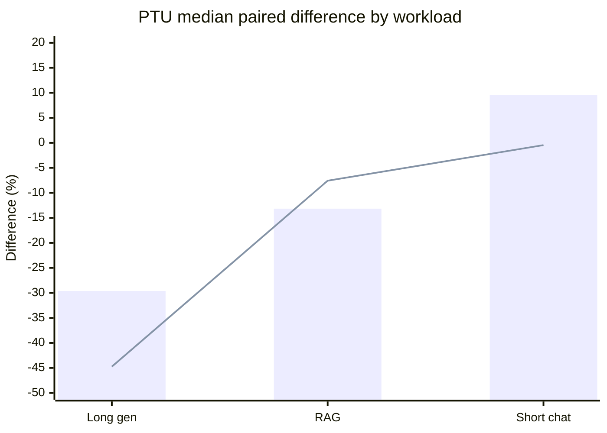
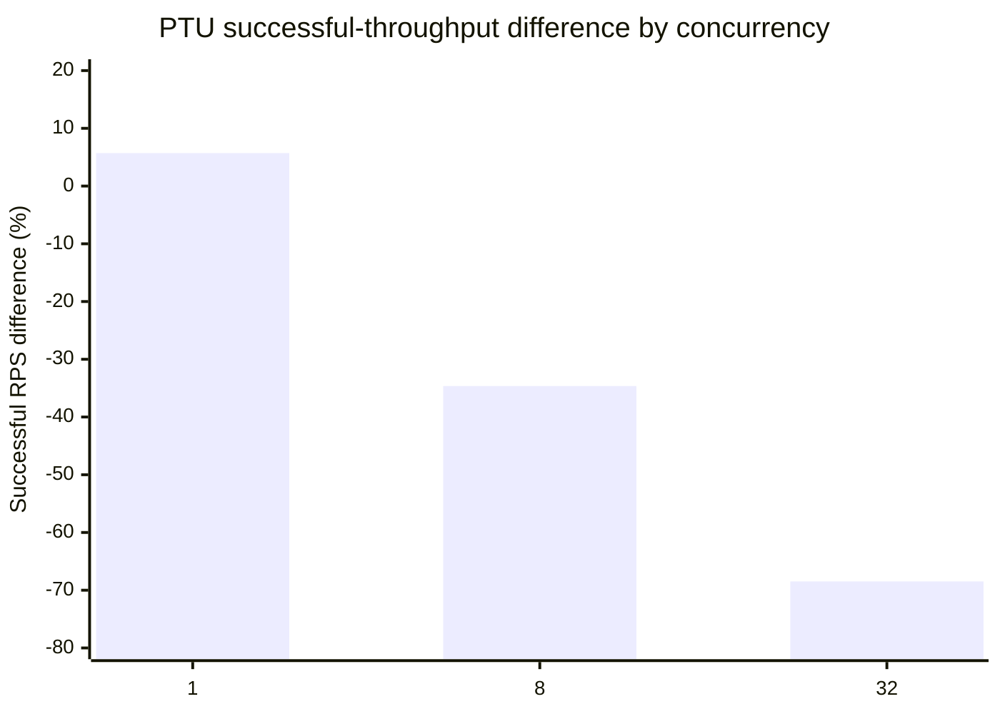

# Terra PayGo vs PTU Benchmark Results

## Executive summary

This report compares the Global Standard PayGo deployment with the provisioned
throughput (PTU) deployment for `gpt-5.6-terra`. It uses only complete records
that have a matching deployment counterpart in the same trial and scenario.

The usable dataset contains **43 deployment-paired comparisons**. Among
successful responses, PTU reduced median paired latency by **13.45% at p50**,
**16.15% at p95**, and **19.54% at p99**. Streaming TTFT improved by about
**21-22%**. The largest latency improvement appeared in long-generation
workloads.

Latency and successful throughput answer different questions. Latency is
calculated only from requests that succeeded: it measures how quickly the
successful responses returned. Successful requests per second (RPS) measures
how many requests completed successfully during the scenario: it reflects
capacity as well as throttling and failures. A deployment can therefore return
its successful responses faster while completing fewer successful requests.

That is what happened here under stress. PayGo delivered higher successful
throughput in **32 of 43 pairs**, while PTU won 7 and tied 4. PTU's median
paired successful-RPS difference was **-9.93%**, meaning that PTU completed
9.93% fewer successful requests per second in the median paired comparison.
At concurrency 32, PTU completed **68.48% fewer** successful requests per
second even though its successful responses had lower latency. These results
support a latency-versus-capacity tradeoff, not a universal advantage for
either SKU.

## Experiment

| Setting | Value |
|---|---|
| Run ID | `20260902T113227Z-36f47022` |
| Model | `gpt-5.6-terra`, version `2026-07-09` |
| Region | Sweden Central |
| Client location | Amsterdam |
| PayGo SKU | Global Standard, capacity 100 |
| PTU SKU | Global Provisioned Managed, capacity 35 |
| Trials | 2 |
| Scenario duration | 100 seconds |
| Concurrency levels | 1, 8, 32 |
| Offered-load rates | 18, 35.7, 53 RPM |
| Streaming rates | 18, 35.7 RPM |
| Workloads | Short chat, RAG, long generation |
| Retries | Disabled |
| Run status | Stopped at the 179.833-minute wall-clock limit |

Sources: [manifest.json](results/terra/20260902T113227Z-36f47022/manifest.json),
[aggregates.json](results/terra/20260902T113227Z-36f47022/aggregates.json), and
[stopped.json](results/terra/20260902T113227Z-36f47022/stopped.json).

## Selection and methodology

- Records marked `partial: true` were excluded.
- A comparison requires complete `global-standard` and `provisioned` records
  with the same `(trial, scenario_id)`.
- Trial 0 contributes all **24/24** scenario pairs.
- Trial 1 contributes **19/24** scenario pairs.
- Each percentage difference is calculated per pair as
  `(PTU - PayGo) / PayGo * 100`, then the median is taken across pairs.
- Negative values favor PTU for latency, TTFT, queue delay, backlog, and error
  rates. Positive values favor PTU for throughput and success rate.
- Scenario-level results combine available trial-level differences by median.
- The paired analysis is primary. Pooled request totals are included only as
  descriptive reliability context because high-concurrency scenarios dominate
  their request counts.
- The PayGo and PTU medians shown in the overall table are calculated
  independently. They can differ in direction from the median of the 43 paired
  percentage differences.

### Excluded trial 1 records

The following complete PTU records had no complete PayGo counterpart and were
excluded from all comparisons:

- `load-short-chat-r18`
- `load-short-chat-r35.7`
- `ttft-long-gen-r35.7`
- `ttft-rag-r18`
- `ttft-rag-r35.7`

The trial 1 PayGo record for `ttft-long-gen-r35.7` was partial and was also
excluded. Consequently, these five scenarios have one paired trial; the other
19 scenarios have two paired trials.

## Overall paired comparison

| Metric | Pairs | PayGo median | PTU median | Median paired difference | PTU wins / ties / losses |
|---|---:|---:|---:|---:|---:|
| Latency p50 | 43 | 4.830 s | 4.220 s | **-13.45%** | 32 / 0 / 11 |
| Latency p95 | 43 | 5.601 s | 4.927 s | **-16.15%** | 31 / 0 / 12 |
| Latency p99 | 43 | 6.154 s | 5.896 s | **-19.54%** | 30 / 0 / 13 |
| TTFT p50, streaming only | 9 | 4.648 s | 3.593 s | **-20.96%** | 7 / 0 / 2 |
| TTFT p95, streaming only | 9 | 5.371 s | 4.182 s | **-22.15%** | 7 / 0 / 2 |
| Successful requests/s | 43 | 0.5741 | 0.3461 | **-9.93%** | 7 / 4 / 32 |
| Completion tokens/s | 43 | 259.06 | 146.98 | **-9.93%** | 7 / 4 / 32 |
| Total tokens/s | 43 | 641.39 | 399.61 | **-9.93%** | 8 / 2 / 33 |
| Success rate | 43 | 100% | 95.833% | **0.00%** | 5 / 18 / 20 |
| Queue delay p50 | 25 | 7.766 ms | 7.961 ms | **-0.26%** | 13 / 0 / 12 |
| Queue delay p95 | 25 | 15.418 ms | 15.407 ms | **+1.14%** | 11 / 0 / 14 |
| Peak client backlog | 25 | 1 | 1 | **0.00%** | 0 / 25 / 0 |

Latency and TTFT include successful responses only; throttled, timed-out, and
otherwise failed attempts are excluded from those percentiles. Successful RPS
is the number of successful completions divided by scenario duration. Lower is
better for latency and TTFT, while higher is better for successful throughput.
Consequently, lower latency does not imply higher successful RPS: PTU can be
faster for the requests it completes but complete fewer requests overall. For
example, the independent queue-delay medians are slightly higher for PTU even
though the median pair-level difference is -0.26%; these are different
aggregations.

Queue pressure in the runner was negligible. Peak client backlog was exactly 1
for both deployments in every applicable pair, so the major service-level
differences are not explained by runner-side queuing.

## Comparison by workload

| Workload | Pairs | Latency p50 | Latency p95 | Successful RPS |
|---|---:|---:|---:|---:|
| Long generation | 15 | **-29.61%** | **-29.57%** | **-44.74%** |
| RAG | 14 | -13.15% | -14.15% | -7.57% |
| Short chat | 14 | **+9.57%** | **+10.30%** | -0.45% |

Bars show p50 latency; the line shows successful RPS. Negative latency is
better for PTU, while negative RPS is worse for PTU.

PTU had lower successful-response latency for long generation and RAG, but
higher latency for short chat. The long-generation latency improvement came
with sharply lower successful throughput under concurrency.

### Streaming TTFT by workload

| Workload | TTFT p50 difference | TTFT p95 difference |
|---|---:|---:|
| Long generation | **-35.41%** | **-33.55%** |
| RAG | **-22.12%** | **-23.61%** |
| Short chat | -1.15% | -2.87% |

## Concurrency scaling

| Concurrency | Pairs | Latency p50 | Latency p95 | Successful RPS |
|---|---:|---:|---:|---:|
| 1 | 6 | -16.84% | -19.93% | **+5.71%** |
| 8 | 6 | -11.16% | -13.27% | **-34.64%** |
| 32 | 6 | -13.20% | -11.02% | **-68.48%** |

At concurrency 1, PTU had lower latency and 5.71% higher successful RPS, but
completed 123 of 137 attempts versus PayGo's 134 of 134. At concurrency 32,
the same row says two things: PTU's successful responses were 13.20% faster at
p50 and 11.02% faster at p95, but PTU produced 68.48% fewer successful
completions per second. Failed and throttled attempts do not appear in the
latency percentiles. Latency must therefore be interpreted together with
successful throughput, success rate, and error counts.

## Offered-load scaling

| Offered rate | Pairs | Latency p50 | Latency p95 | Successful RPS | Total tokens/s | Pooled success, PayGo -> PTU |
|---|---:|---:|---:|---:|---:|---:|
| 18 RPM | 5 | -12.87% | -9.22% | 0.00% | 0.00% | 100% -> 98.17% |
| 35.7 RPM | 5 | -13.44% | -17.80% | -0.18% | -0.18% | 100% -> 81.61% |
| 53 RPM | 6 | -12.67% | -19.27% | **-12.22%** | **-12.22%** | 100% -> 74.38% |

PTU kept its latency advantage as offered load increased, but its completion
rate declined. At 53 RPM, median successful throughput was 12.22% lower and the
pooled success rate was 74.38%, versus 100% for PayGo.

## Streaming-load scaling

| Streaming rate | Pairs | TTFT p50 | TTFT p95 | Successful RPS | Pooled success, PayGo -> PTU |
|---|---:|---:|---:|---:|---:|
| 18 RPM | 5 | **-20.96%** | **-25.07%** | 0.00% | 100% -> 96.38% |
| 35.7 RPM | 4 | **-21.71%** | **-21.21%** | **-27.22%** | 100% -> 84.29% |

At 18 RPM, PTU improved TTFT without reducing median successful throughput. At
35.7 RPM, the TTFT improvement remained, but successful throughput fell by
27.22%. Only four pairs were available at 35.7 RPM because two trial 1 PayGo
streaming scenarios were incomplete or absent.

## Reliability and throttling

Error counts below are reconstructed from each aggregate's rate and request
count. They reconcile with `requests - successful` across all selected records.

| Deployment | Requests | Successful | Pooled success | HTTP 429 | Timeout | Other errors |
|---|---:|---:|---:|---:|---:|---:|
| PayGo | 52,084 | 4,146 | 7.960% | 47,938 (92.040%) | 0 | 0 |
| PTU | 21,797 | 2,711 | 12.438% | 19,078 (87.526%) | 8 (0.037%) | 0 |

These pooled percentages are dominated by fast repeated 429 responses in the
closed-loop concurrency scenarios and should not be read as typical request
success rates. Pair-level behavior is more representative:

- PTU had a lower 429 rate in 5 pairs, tied in 20, and had a higher rate in 18.
- A paired 429 percentage difference is undefined in 37 pairs because PayGo's
  429 rate was zero.
- PayGo recorded no timeouts. PTU recorded eight timeouts across five pairs.
- Neither deployment recorded other error types in the selected records.

## Scenario-level extremes

Scenario results are medians across available paired trials. Entries marked
"one trial" are directional because the second trial was excluded.

| Metric | Strongest PTU result | Weakest PTU result |
|---|---|---|
| Latency p50 | `ttft-long-gen-r35.7`: **-36.62%** (one trial) | `load-short-chat-r35.7`: **+14.32%** (one trial) |
| Latency p95 | `ttft-long-gen-r35.7`: **-37.48%** (one trial) | `load-short-chat-r18`: **+36.82%** (one trial) |
| Latency p99 | `ttft-long-gen-r35.7`: **-39.70%** (one trial) | `load-short-chat-r18`: **+118.34%** (one trial) |
| TTFT p50 | `ttft-long-gen-r35.7`: **-37.68%** (one trial) | `ttft-short-chat-r18`: **-0.28%** |
| TTFT p95 | `ttft-long-gen-r35.7`: **-38.37%** (one trial) | `ttft-short-chat-r18`: **+34.92%** |
| Successful RPS | `conc-long-gen-c1`: **+42.12%** | `conc-long-gen-c32`: **-86.95%** |
| Queue delay p95 | `load-long-gen-r35.7`: **-5.85%** | `ttft-short-chat-r18`: **+18.89%** |

## Decision guide

| Tested priority | Better fit | Evidence |
|---|---|---|
| Lower successful-response latency, especially long generation | PTU | Overall p50 -13.45%; long-gen p50 -29.61% |
| Lower streaming TTFT | PTU | TTFT p50 -20.96%; p95 -22.15% |
| Successful throughput at concurrency 8 or 32 | PayGo | PTU RPS -34.64% and -68.48% |
| Short-chat latency | PayGo | PTU p50 +9.57%; p95 +10.30% |
| Minimal runner-side queue pressure | Tie | Peak backlog 1 in every applicable pair |

## Limitations

- Only two trials were configured, and five scenarios have only one valid
  paired trial. This is insufficient for strong statistical confidence.
- Trial 0 ran PayGo first and trial 1 ran PTU first. Order is balanced only for
  the 19 scenarios completed in both trials.
- On the common 19-scenario population, trial 0 versus trial 1 median
  differences were -12.87% versus -15.99% for p50 latency, -13.08% versus
  -16.15% for p95 latency, and -26.10% versus -2.81% for successful RPS. The
  throughput variation limits confidence in a stable effect size.
- Sample-size warnings apply to 32 of 43 PayGo records and 39 of 43 PTU records.
  Both sides warn in 32 pairs, PTU alone warns in 7, and neither side warns in
  4. All 18 records in the nine streaming pairs warn for TTFT. Reported tail
  percentiles from warned records are directional.
- Missing data is not random. The wall-clock stop occurred late in trial 1 and
  disproportionately removed short-chat and streaming PayGo observations.
- The source tree was dirty when the benchmark began. The manifest hashes the
  runner and configuration, but exact reproduction also requires preserving
  the corresponding source state.
- The benchmark contains client-observed metrics only. Azure Monitor telemetry
  should be correlated over each aggregate's UTC window before making capacity
  or production-sizing decisions.

The completed pairs support an internal directional comparison. A formal or
external benchmark should use a matrix that completes within the limit, collect
more than two trials, and continue to exclude unmatched or partial records.